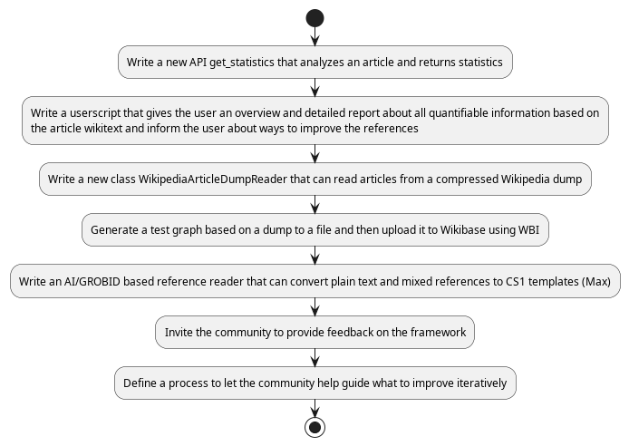
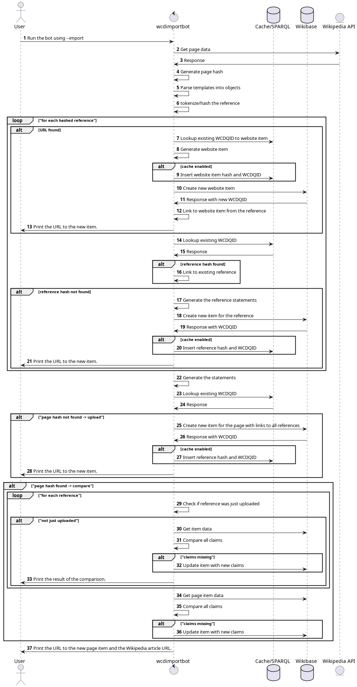

# [wcdimportbot](https://www.wikidata.org/wiki/Q115252313) ([graph](https://w.wiki/5$yU))
This ETL-framework is capable of fetching, extracting, transforming and storing 
reference information from Wikipedia articles as [structured data](https://www.wikidata.org/wiki/Q26813700) 
in a [Wikibase.cloud](https://wikibase.cloud/) instance. We call the resulting database Wikipedia Citations Database (WCD).

The framework has been developed by [James Hare](https://www.wikidata.org/wiki/Q23041486) (version 1.0.0 a proof of concept import tool based on WikidataIntegrator)
and [Dennis Priskorn](https://www.wikidata.org/wiki/Q111016131) (version 2.0.0+ a scalable ETL-framework with an API 
and capability of reading EventStreams and version 3.0.0+ with graph generation from Wikipedia dumps and an 
article_statistic API) as part of the 
[Turn All References Blue project](https://www.wikidata.org/wiki/Q115136754) which is led by 
Mark Graham, head of The 
[Wayback Machine](https://www.wikidata.org/wiki/Q648266) department of the [Internet Archive](https://www.wikidata.org/wiki/Q461).

The 200 million references are together with the article text in the Wikipedias 
one of the most valuable collections of knowledge ever made by humans, see [size comparison](https://en.wikipedia.org/wiki/Wikipedia:Size_comparisons).

A Wikibase with millions of references and edges between 
them and the Wikipedia article(s) they are used on is useful
 for both Wikimedians, digital librarians and researchers who wish to understand
 which websites are linked to which pages and used as references.

This is part of a wider initiative help raise the quality of references in 
Wikipedia to enable everyone in the world to make
 decisions based on trustworthy knowledge that is derived from 
trustworthy sources.

# What is Wikibase?
Wikibase is a FLOSS graph database which enables users to store large
amounts of information and query them using [SPARQL](https://en.wikibooks.org/wiki/SPARQL).
Wikibase has been created by [Wikimedia Deutchland](https://www.wikimedia.de/) and is 
maintained by them as of this writing.

# Why store the data about references in a graph database?
The advantages of having access to this data in a graph are many.
* [Globally unique and persistent identifiers](https://www.wikidata.org/wiki/Q115493815)(aka. GUPRI) for as many references in Wikipedia as possible.
* Helping Wikipedians to improve the references so they can be uniquely identified and can be [_turned blue_](https://www.wikidata.org/wiki/Q115136754) ([video](https://commons.wikimedia.org/wiki/File:Let%E2%80%99s_Turn_all_the_References_Blue.webm))
* Overview and visualization of references across Wikipedia articles and language editions becomes possible.
* Overview of most cited websites in the world (see also [bestref.net](https://bestref.net/) 
which is based on data extraction from the dump files)
* Insight into how many references have URLs, authors and other valuable information.
* Using SPARQL it becomes trivial for anyone to e.g. pinpoint pages with less trustworthy sources
* Using the data over time can help follow and understand changes in patterns of referencing.
* and more...

# Use cases
1. To support various queries of various citation types to learn various things about cited material.  E.g. number of citations per source or publication.
2. To be able to query to learn about how well citations are linked... to help us understand the gaps, scale and scope of the Goal of Turn All References Blue.

# Estimated size
200+ million reference items (add source to research extracting references from Wikipedias). 100+ million website items (guesstimate). [60 million wikipedia article](https://en.wikipedia.org/wiki/Wikipedia:Size_of_Wikipedia#Comparisons_with_other_Wikipedias) items. In total ~260 million items. For comparison [Wikidata as of this writing have 100 million items](https://grafana.wikimedia.org/d/000000489/wikidata-query-service?orgId=1&refresh=1m).

In total we estimate we will have 15 triples per item which equals 15 bn triples in total. For comparison, [Wikidata as of this writing have 14.4 bn triples](https://grafana.wikimedia.org/d/000000489/wikidata-query-service?orgId=1&refresh=1m).

# Supported templates
There are a lot of templates in use in the different Wikipedias. For now 
the bot only supports templates and parameters from English Wikipedia 
but intention is to code it in a way that avoids hardcoding of 
enwp specific templates and parameters.

## English Wikipedia templates
English Wikipedia has hundreds of special reference templates in use 
and a handful of widely used generic templates.

Currently the focus is on supporting the most widely used reference 
templates in English Wikipedia.

### List of currently supported templates
See [config_sample.py](config_sample.py) for a list of templates.

# Terminology
We use the following terminology:
* citation: this is what is called a reference in Wikipedia and could be uniquely 
identified by one of the supported identifiers (ie DOI, ISBN, PMID, OCLC, URL)
* string citation: this is a reference that could not be uniquely identified.

# Features
Currently the framework has the following features:
* support for English Wikipedia only
* generation of a Wikibase graph based on a Wikipedia dump and upload it to Wikibase 
* API endpoint which helps jump from an article to the item in the Wikibase
* API endpoint which analyze a given article and returns statistics about it (number of references, 
number of citation templates of different types, number of references outside <ref>s, etc.)

# Diagrams

## Components

## Roadmap

## Article import sequence

## Ingester sequence

## Worker sequence

# License
This project is licensed under GPLv3+. Copyright Dennis Priskorn 2022
The diagram PNG files are CC0.

# Further reading and installation/setup
See the [development notes](DEVELOPMENT_NOTES.md)